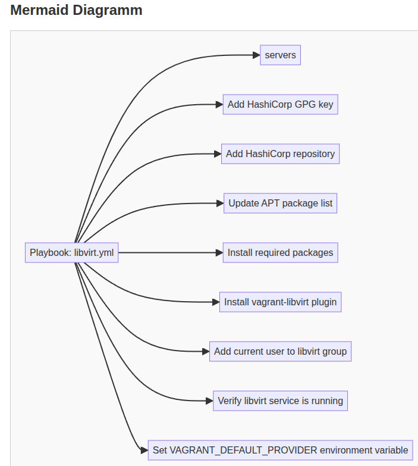

# Ansible UML Visualizer

A small FastAPI web app that scans an Ansible repository (local path or git URL), finds inventories and playbooks, and generates a Mermaid diagram showing groups, hosts and tasks.

Links
- App instance and route handlers: [`main.app`](main.py), [`main.index`](main.py), [`main.scan_repo`](main.py), [`main.generate_diagram`](main.py)
- Web template: [templates/index.html](templates/index.html)
- Dependencies: [requirements.txt](requirements.txt) and [pyproject.toml](pyproject.toml)

## Quickstart

### 1. Create and activate a virtual environment:
```sh
python -m venv .venv
source .venv/bin/activate
```
### 2. Run the app
```sh
uv sync
.venv/bin/uvicorn main:app --reload --port 8000
```

### 4. Open your browser at http://127.0.0.1:8000 and use the web UI to:

Enter a Git URL or a local repo path and click "Scan starten"
Select inventories and playbooks, choose layout, and click "Diagramm erstellen"

### Example Screenshot


## What it does (brief)

Scans the repository for inventory files under any inventory/ directory and playbooks under playbooks/*.yml.
Loads inventories with PyYAML to discover groups and hosts.
Loads playbooks and extracts plays, hosts, and tasks.
Produces a Mermaid graph (rendered in the UI) that shows playbooks → groups → tasks and groups → hosts.

## Notes & tips

The app tries to checkout main then master after cloning a repo.
Inventories are expected to be YAML under an inventory/ folder. Playbooks are expected under playbooks/*.yml and must contain hosts:.
Host and group names are sanitized for Mermaid node IDs by functions in main.py.
